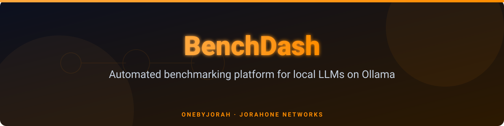

# BenchDash


[](https://github.com/OneByJorah/BenchDash/pulls)

> Automated benchmarking platform for local LLMs running on [Ollama](https://ollama.com/).

BenchDash is an early-stage, design-first platform for running structured benchmarks against local LLMs served by Ollama. The system collects hardware telemetry, runs configurable benchmark tasks, and scores model responses on accuracy, latency, and token throughput. Results are stored as JSON and displayed through a lightweight, zero-dependency dashboard.

**⚠️ Project Status: Pre-Alpha** — Benchmark engine, scoring pipeline, and persistence layer are planned but not yet implemented. The dashboard currently displays sample/demo data. See [Implementation Status](#implementation-status) for details.

---

## Key Features

- **System Telemetry Collector** — Gathers CPU, GPU, memory, and OS info in Python.
- **Static Dashboard** — Standalone `index.html` UI with no build step or dependencies; shows model comparisons, scores, and system metrics.
- **Ollama Integration** — Designed to query local Ollama API for available models and run inference benchmarks.
- **Docker Support** — Production-ready Dockerfile and docker-compose for containerized deployment.
- **Configurable Benchmarks** — YAML-based task definitions for evaluation categories, weights, and scoring.
- **JSON Persistence** — All benchmark results stored as timestamped JSON files for historical analysis.

---

## Quick Start

### Prerequisites

- Python 3.11+
- Ollama running locally (`http://localhost:11434`)
- Docker & Docker Compose (optional, for containerized deployment)

### Install from Source

```bash
git clone https://github.com/OneByJorah/BenchDash.git
cd BenchDash
chmod +x install.sh
./install.sh
```

### Run Locally

```bash
# Install dependencies
pip install -r requirements.txt

# Launch the dashboard server
python -m http.server 8081
# Open http://localhost:8081 in your browser
```

### Run with Docker

```bash
docker compose up -d
# Open http://localhost:8081
```

---

## Docker

The included `Dockerfile` builds a lightweight Alpine-based image that serves the static dashboard via `thttpd` on port **8081**.

```bash
# Build and start
docker compose up -d --build

# Check status
docker compose ps

# View logs
docker compose logs -f

# Stop
docker compose down
```

**Environment Variables** (via `.env` or `docker-compose.yml`):

| Variable | Default | Description |
|---|---|---|
| `OLLAMA_HOST` | `http://host.docker.internal:11434` | Ollama API endpoint |
| `BENCH_DATA_DIR` | `/data` | Directory for benchmark results |
| `DASHBOARD_PORT` | `8081` | Dashboard port |

---

## Project Structure

```
BenchDash/
├── index.html            # Standalone dashboard UI (no build step)
├── collector/
│   └── system_info.py    # System telemetry collector (CPU, GPU, RAM)
├── docs/
│   └── assets/           # Banner, screenshots
├── Dockerfile            # Alpine + thttpd, serves on port 8081
├── docker-compose.yml    # Container orchestration with healthcheck
├── install.sh            # Linux/macOS installer
├── install.ps1           # Windows installer
├── requirements.txt      # Python dependencies
├── j1.yaml               # Benchmark task definitions
├── INTENT.md             # Design specification
├── LICENSE               # MIT License
└── .env.example          # Environment variable template
```

---

## Architecture

```
┌─────────────┐     ┌──────────────┐     ┌────────────────┐
│  Dashboard  │────▶│  Collector   │────▶│     Ollama     │
│  (HTML/JS)  │     │  (Python)    │     │  (Local LLMs)  │
└─────────────┘     └──────────────┘     └────────────────┘
       │                    │
       │                    ▼
       │            ┌──────────────┐
       └───────────▶│  JSON Store  │
                    │  (Results)   │
                    └──────────────┘
```

---

## Implementation Status

| Component | Status |
|---|---|
| System Info Collector | ✅ Implemented |
| Dashboard UI (sample data) | ✅ Implemented |
| Docker packaging | ✅ Implemented |
| Install scripts | ✅ Implemented |
| Benchmark Engine | 🔲 Planned |
| Scoring Pipeline | 🔲 Planned |
| JSON Persistence | 🔲 Planned |
| Scheduler (Cron) | 🔲 Planned |
| Notifications | 🔲 Planned |
| Flask/FastAPI Backend | 🔲 Planned |

---

## Development

```bash
# Clone and enter the repo
git clone https://github.com/OneByJorah/BenchDash.git
cd BenchDash

# Create virtual environment
python -m venv .venv
source .venv/bin/activate  # Linux/macOS
# .venv\Scripts\activate   # Windows

# Install dev dependencies
pip install -r requirements.txt

# Run the dashboard locally
python -m http.server 8081
```

---

## Contributing

Contributions are welcome! Please read the [INTENT.md](INTENT.md) for the design specification before submitting a PR.

1. Fork the repository
2. Create a feature branch (`git checkout -b feature/your-feature`)
3. Commit your changes (`git commit -m "Add your feature"`)
4. Push to the branch (`git push origin feature/your-feature`)
5. Open a Pull Request

---

## License

MIT License — see [LICENSE](LICENSE) for details.

---

<p align="center">
  Built with care by <a href="https://github.com/OneByJorah">OneByJorah</a>
</p>
