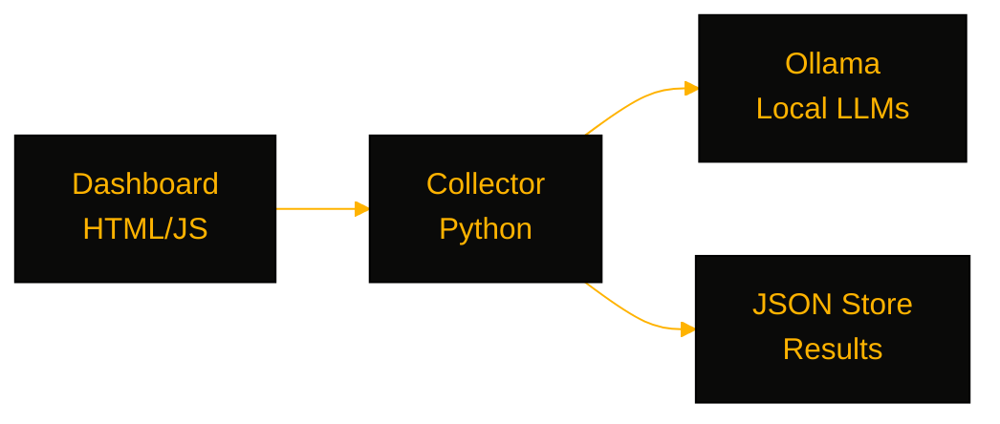

# BenchDash

> A benchmarking platform for local LLMs on Ollama — auto-discover models, run structured test suites, and compare accuracy, latency, and token throughput.

[](https://github.com/OneByJorah/BenchDash)
[](https://github.com/OneByJorah/BenchDash)
[](https://github.com/OneByJorah/BenchDash/stargazers)
[](https://github.com/OneByJorah/BenchDash/commits)


## What This Is

Comparing local LLMs usually means ad-hoc prompts and a stopwatch. BenchDash aims to make that repeatable: discover the models Ollama has loaded, run a fixed task suite, and rank results on accuracy, latency, and throughput. Today the system-telemetry collector, dashboard UI, Docker packaging, and install scripts exist; the benchmark engine and scoring pipeline are on the roadmap.

> [!WARNING]
> **Pre-alpha.** The dashboard currently displays sample data. The benchmark engine, scoring pipeline, JSON persistence, and backend server are not yet implemented — the scaffolding does not run end-to-end.

## Quick Start

```bash
git clone https://github.com/OneByJorah/BenchDash.git
cd BenchDash
docker compose up -d
```

Open **http://localhost:8081**. Or serve the dashboard directly: `python -m http.server 8081`.

## Features

- **System telemetry collector** — CPU, GPU, VRAM, CUDA, drivers, memory, and OS info gathered in Python (`collector/system_info.py`).
- **Static dashboard** — standalone `index.html` (no build step) showing model comparisons and system metrics.
- **Ollama integration (planned)** — enumerate local models via the Ollama API and run inference benchmarks.
- **Configurable benchmark tasks** — YAML definitions for categories, weights, and scoring (`j1.yaml`).
- **JSON persistence (planned)** — timestamped results for historical regression tracking.
- **Container packaging** — Alpine image with healthcheck; `install.sh` and `install.ps1` installers.

## Architecture



## Stack

Python 3.11+ · Ollama · HTML/CSS/JS · Docker (Alpine + thttpd) · Docker Compose

## Contributing

Read [INTENT.md](INTENT.md) for the design spec before opening a PR. [Open an issue](https://github.com/OneByJorah/BenchDash/issues) for bugs or ideas.

## License

MIT — see [LICENSE](LICENSE).
