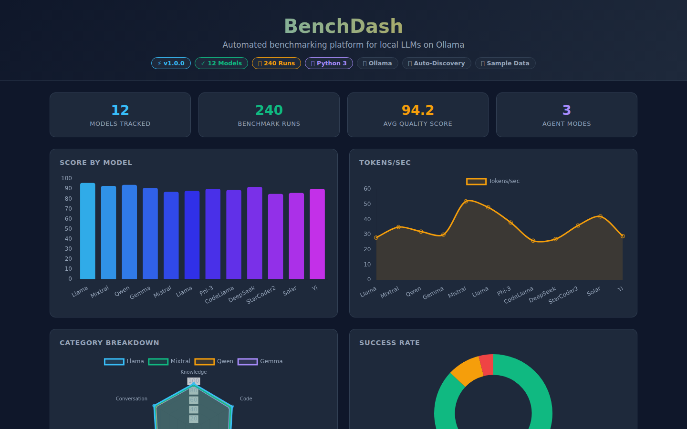
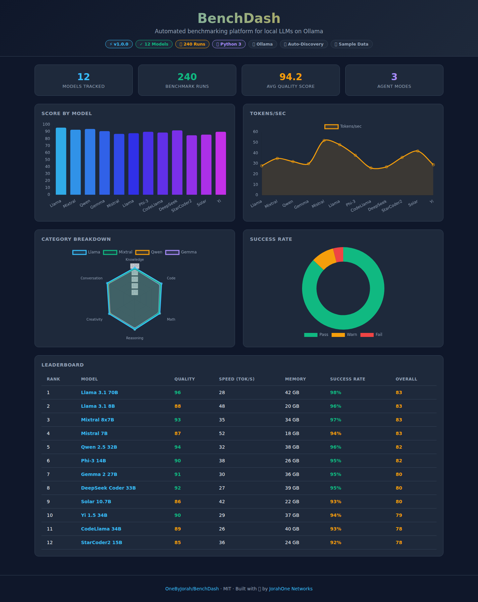
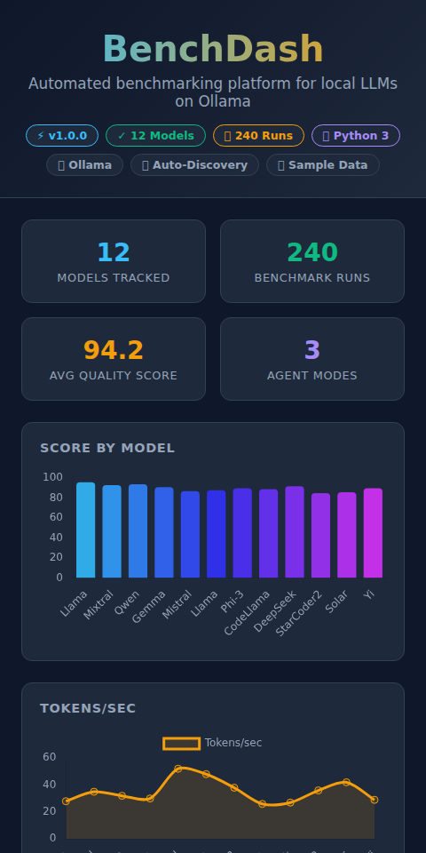
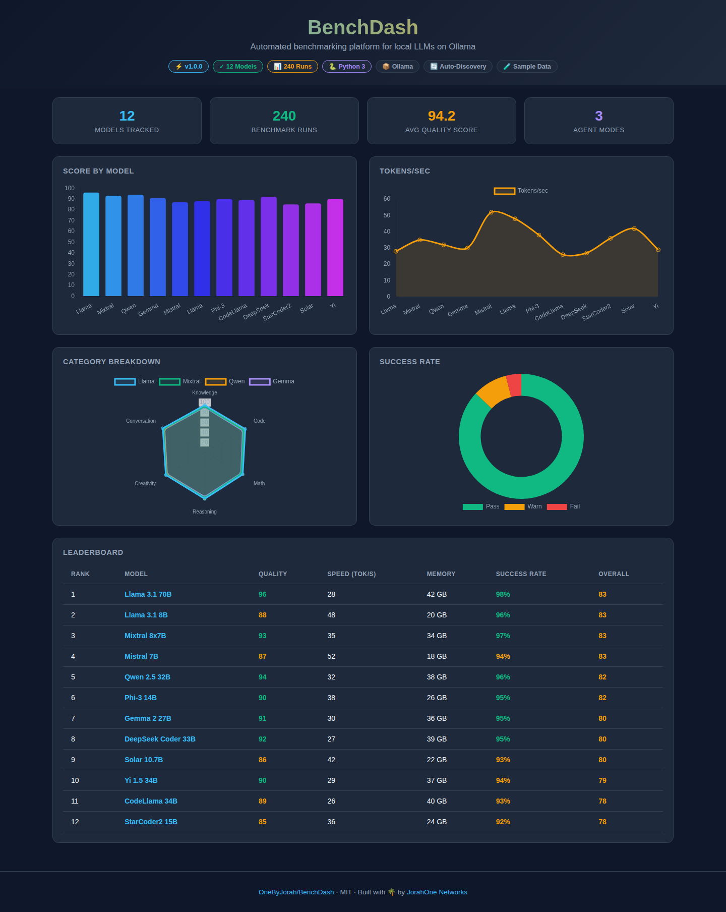

<div align="center">


# BenchDash

**A benchmarking platform for local LLMs on Ollama** — auto-discover models, run structured tests, and compare accuracy, latency, and throughput.

<a href="https://github.com/OneByJorah/BenchDash/stargazers"></a>
<a href="https://github.com/OneByJorah/BenchDash/commits"></a>
<a href="LICENSE"></a>


</div>


## What This Is

Comparing local models usually means ad-hoc prompts and a stopwatch. BenchDash is a design-first platform that aims to make that repeatable: discover the models Ollama has loaded, run a fixed task suite, and rank results on accuracy, latency, and token throughput. Today the collector, dashboard, and packaging exist; the benchmark engine and scoring pipeline are planned.

> [!WARNING]
> **Pre-alpha.** The dashboard currently displays sample/demo data. The benchmark engine, scoring pipeline, JSON persistence, and backend server are not yet implemented — this scaffolding is not functional end-to-end.

## Quick Start

```bash
git clone https://github.com/OneByJorah/BenchDash.git
cd BenchDash
docker compose up -d
```

Open **http://localhost:8081**. Run the dashboard locally with `python -m http.server 8081` instead if you prefer.

## Features

- **System telemetry collector** — gathers CPU, GPU, VRAM, CUDA, drivers, memory, and OS info in Python.
- **Static dashboard** — standalone `index.html` with no build step; shows model comparisons, scores, and system metrics.
- **Ollama integration (planned)** — queries the local Ollama API to enumerate models and run inference benchmarks.
- **Configurable benchmarks** — YAML task definitions for categories, weights, and scoring.
- **JSON persistence (planned)** — timestamped result files for historical comparison.
- **Docker support** — Alpine image and Compose file for containerized deployment.
- **Install scripts** — `install.sh` (Linux/macOS) and `install.ps1` (Windows).

## Architecture

```
┌─────────────┐     ┌──────────────┐     ┌────────────────┐
│  Dashboard  │────▶│  Collector   │────▶│     Ollama     │
│  (HTML/JS)  │     │  (Python)    │     │  (Local LLMs)  │
└─────────────┘     └──────────────┘     └────────────────┘
       │                    │
       │                    ▼
       │            ┌──────────────┐
       └───────────▶│  JSON Store  │
                    │  (Results)   │
                    └──────────────┘
```

## Implementation Status

| Component | Status |
|---|---|
| System info collector | Implemented |
| Dashboard UI (sample data) | Implemented |
| Docker packaging | Implemented |
| Install scripts | Implemented |
| Benchmark engine | Planned |
| Scoring pipeline | Planned |
| JSON persistence | Planned |
| Scheduler (cron) | Planned |
| Notifications | Planned |
| Flask/FastAPI backend | Planned |

## Configuration

| Variable | Default | Description |
|---|---|---|
| `OLLAMA_HOST` | `http://host.docker.internal:11434` | Ollama API endpoint |
| `DASHBOARD_PORT` | `8081` | Dashboard port |
| `DASHBOARD_HOST` | `<ip-address>` | Dashboard bind host |
| `BENCH_SKIP_MEDIA` | `0` | Set to `1` to skip image/audio/video tests |
| `BENCH_DATA_DIR` | `/app/results` | Directory for benchmark results |
| `TELEGRAM_BOT_TOKEN` / `TELEGRAM_CHAT_ID` | — | Optional notifications |

## Development

```bash
git clone https://github.com/OneByJorah/BenchDash.git
cd BenchDash

python -m venv .venv
source .venv/bin/activate   # Linux/macOS
# .venv\Scripts\activate    # Windows

python -m http.server 8081  # serve the dashboard locally
```

See [INTENT.md](INTENT.md) for the design specification.

## Project Structure

```
BenchDash/
├── index.html            # Standalone dashboard UI (no build step)
├── collector/
│   └── system_info.py    # System telemetry collector (CPU, GPU, RAM)
├── docs/assets/          # Banner, screenshots
├── Dockerfile            # Alpine + thttpd, serves on port 8081
├── docker-compose.yml    # Container orchestration with healthcheck
├── install.sh            # Linux/macOS installer
├── install.ps1           # Windows installer
├── requirements.txt      # Python dependencies
├── j1.yaml               # Benchmark task definitions
├── INTENT.md             # Design specification
└── .env.example          # Environment variable template
```

## Tech Stack

Python 3.11+ · Ollama · HTML/CSS/JS · Docker (Alpine + thttpd) · Docker Compose

## Screenshots

| View | |
|---|---|
|  |  |
|  |  |

## Contributing

Contributions are welcome. Please read [INTENT.md](INTENT.md) for the design specification before submitting a PR. [Open an issue](https://github.com/OneByJorah/BenchDash/issues).

## License

MIT — see [LICENSE](LICENSE).

## Connect

- [jorahone.com](https://jorahone.com)
- [GitHub Org](https://github.com/OneByJorah)
- [info@jorahone.com](mailto:info@jorahone.com)
