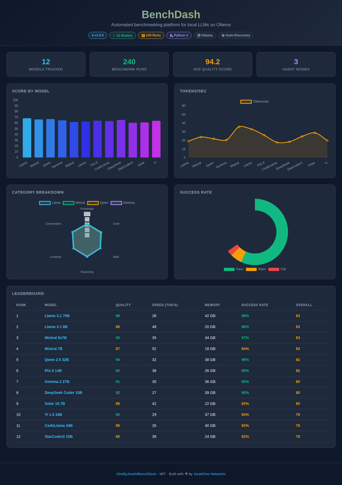

<div align="center">


# BenchDash

**Automated benchmarking platform for local LLMs on Ollama**

[](LICENSE)
[](https://python.org)
[](https://ollama.ai)
[](CONTRIBUTING.md)
[](https://github.com/OneByJorah/BenchDash/stargazers)
[](https://github.com/OneByJorah/BenchDash/actions)
[](index.html)

</div>

---

<p align="center">
  
  <br>
  <sub><i>BenchDash live dashboard — model leaderboard, performance charts, and system telemetry</i></sub>
</p>

---

## Features

- **Auto-Discovery** — Automatically discover all Ollama models on the host
- **Multi-Dimension Benchmarks** — 13+ test categories: knowledge, code, math, reasoning, creativity, conversation, vision, generation, game dev, error resilience, consistency, context stress
- **Multi-Agent Modes** — Compare models via raw Ollama API, Hermes Agent, and Claude Code
- **Real-Time Dashboard** — Chart.js-powered UI with leaderboards, radar charts, and speed metrics
- **System Telemetry** — Collect CPU, RAM, GPU, VRAM, CUDA, driver, and OS metrics alongside every run
- **History Tracking** — SQLite persistence with per-model JSON exports for trend analysis
- **Scoring System** — Discrete-tier scoring (0.1–1.0) with per-category and overall leaderboards
- **Export** — Results to CSV, JSON, and Markdown report formats
- **Scheduling** — Cron-style daily/weekly/monthly automated benchmarks
- **Notifications** — Telegram integration for run completion alerts

## Quick Start

```bash
git clone https://github.com/OneByJorah/BenchDash.git
cd BenchDash

pip install -r requirements.txt
python3 app.py
```

Open **http://localhost:5000** in your browser.

### Docker

```bash
docker compose up -d
```

Then open **http://localhost:5000**.

### Dashboard Only

The standalone dashboard (`index.html`) requires no server — just open it in a browser, or serve it:

```bash
python3 -m http.server 8080
```

Open **http://localhost:8080**.

## Configuration

| Variable | Default | Description |
|---|---|---|
| `OLLAMA_URL` | `http://localhost:11434` | Ollama API endpoint |
| `PORT` | `5000` | Dashboard port |
| `BENCHMARK_PROMPTS` | — | Custom benchmark prompts file |
| `RESULTS_DIR` | `./results` | Benchmark results storage |

## Architecture

```
                    ┌─────────────────┐
                    │   Browser / UI   │
                    └────────┬────────┘
                             │ HTTP
                    ┌────────▼────────┐
                    │   Flask App     │
                    │  (app.py)       │
                    └───┬────┬────┬───┘
                        │    │    │
               ┌────────┤    │    ├──────────┐
               ▼             ▼               ▼
        ┌──────────┐  ┌──────────┐  ┌──────────────┐
        │Benchmark │  │  Results │  │   Scheduler  │
        │  Runner  │  │ Analyzer │  │  (cron-ish)  │
        └────┬─────┘  └────┬─────┘  └──────────────┘
             │             │
             ▼             ▼
        ┌──────────┐  ┌──────────┐
        │  Ollama  │  │  SQLite  │
        │   API    │  │  / JSON  │
        └──────────┘  └──────────┘
```

## Project Structure

```
BenchDash/
├── index.html                  # Standalone dashboard UI
├── app.py                      # Flask application server
├── collector/
│   └── system_info.py          # System telemetry collector
├── bench/
│   ├── __init__.py
│   ├── runner.py               # Benchmark execution engine
│   ├── analyzer.py             # Results analysis & scoring
│   └── prompts/                # Benchmark prompt definitions
├── templates/                  # Flask HTML templates
├── static/                     # CSS, JS, Chart.js assets
├── results/                    # Benchmark output artifacts
├── docs/
│   └── assets/
│       ├── banner.svg          # Project banner
│       └── screenshot.png      # Dashboard screenshot
├── .github/                    # CI, issue templates, Dependabot
├── Dockerfile                  # Container definition
├── docker-compose.yml          # Multi-service orchestration
├── requirements.txt            # Python dependencies
└── README.md
```

## Benchmark Metrics

| Metric | Description |
|---|---|
| **Tokens/sec** | Generation speed |
| **Time to First Token** | Response latency |
| **Quality Score** | Response quality rating (0.1–1.0) |
| **Memory Usage** | RAM consumption (GB) |
| **VRAM Usage** | GPU memory (if applicable) |
| **Success Rate** | Percentage of successful completions |

## Roadmap

- [x] System telemetry collector
- [x] Standalone dashboard UI
- [ ] Benchmark runner engine
- [ ] Multi-agent mode comparison
- [ ] Real-time streaming results
- [ ] Telegram notifications
- [ ] Historical trend charts

See [ROADMAP.md](ROADMAP.md) for full details.

## Contributing

Contributions are welcome. Please see [CONTRIBUTING.md](CONTRIBUTING.md) for guidelines and [CODE_OF_CONDUCT.md](CODE_OF_CONDUCT.md) for community standards.

## Security

For security concerns, see [SECURITY.md](SECURITY.md). Report vulnerabilities to **security@jorahone.com**.

## License

[MIT](LICENSE) © Jhonattan L. Jimenez (OneByJorah)

---

<p align="center">
  Built with 🌴 by <a href="https://github.com/OneByJorah">OneByJorah</a> ·
  <a href="https://jorahone.com">jorahone.com</a>
</p>
